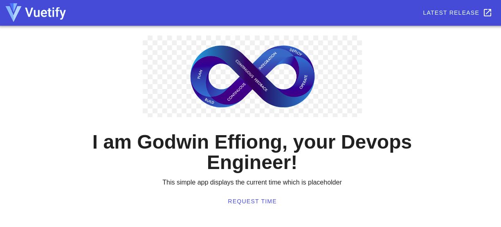
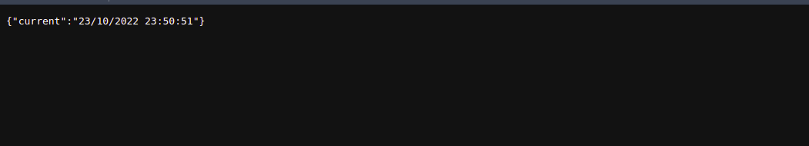

# DevOps-test-project

Helm chart deploying two application containers: a frontend made with Vue JS and its backend made with nodeJS into AWS kubernetes cluster

This simple application on the click of a button fetches the current time from the backend api server and displays it in the frontend
technologies used includes docker, Helm, kubernetes

**STEP:** the output of the frontend will be

---
**STEP:** the output of the backend will be

